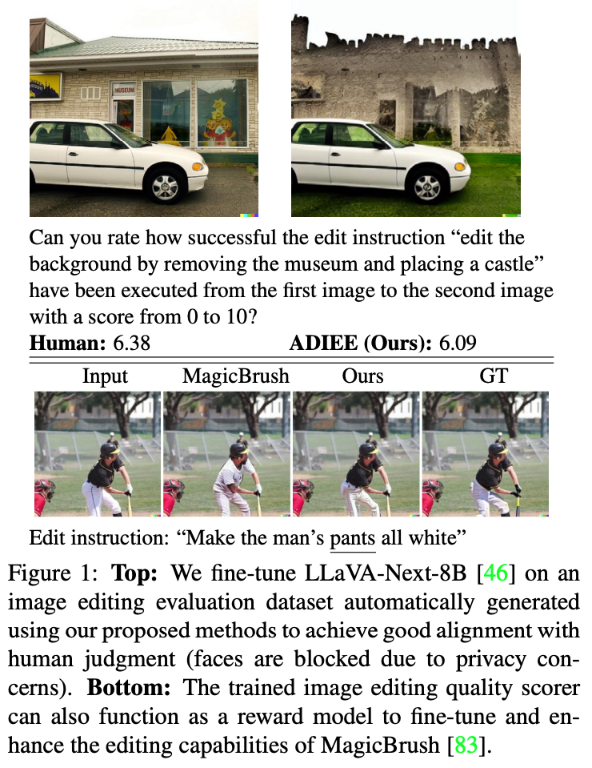

# ADIEE: Automatic Dataset Creation and Scorer for Instruction-Guided Image Editing Evaluation (ICCV 2025)

### [Paper](https://arxiv.org/abs/2507.07317) | [Model Checkpoints](TBD) | [Data](TBD)

## Table of Contents
- [ADIEE: Automatic Dataset Creation and Scorer for Instruction-Guided Image Editing Evaluation (ICCV 2025)](#adiee-automatic-dataset-creation-and-scorer-for-instruction-guided-image-editing-evaluation-iccv-2025)
    - [Paper | Model Checkpoints | Data](#paper--model-checkpoints--data)
  - [Table of Contents](#table-of-contents)
  - [Capabilities](#capabilities)
  - [Installation](#installation)
  - [Image Editing Evaluation Dataset Generation](#image-editing-evaluation-dataset-generation)
  - [Training](#training)
    - [Image Editing Evaluation Model Training](#image-editing-evaluation-model-training)
    - [Image Editing Model Training](#image-editing-model-training)
  - [Inference](#inference)
    - [Benchmark Preparation](#benchmark-preparation)
    - [Image Editing Evaluation Model Inference](#image-editing-evaluation-model-inference)
    - [Image Editing Model Inference](#image-editing-model-inference)

## Capabilities

<p align="center">
  
</p>

## Installation

To setup the environment with NVIDIA GPUs:
```bash
pip install -r requirements.txt
```

To set up the environment with AMD GPUs:
```bash
pip install -r requirements_amd.txt
```

We adapt text-guided image editing models as defined in ImagenHub to generate samples for our evaluation training datasets with customization for batch inference in `inferencemodels_local`. To use these models, install ImagenHub following their instructions [here](https://github.com/TIGER-AI-Lab/ImagenHub.git).

Note that due to the newer `diffusers` version we use, we have commented out `from diffusers.utils import DIFFUSERS_CACHE` and manually define this environment variable in these files ([simple_tokenizer.py](https://github.com/TIGER-AI-Lab/ImagenHub/blob/main/src/imagen_hub/pipelines/text2live/text2live_src/CLIP/clip/simple_tokenizer.py), [clip_extractor.py](https://github.com/TIGER-AI-Lab/ImagenHub/blob/main/src/imagen_hub/pipelines/text2live/text2live_src/models/clip_extractor.py), [image_model.py](https://github.com/TIGER-AI-Lab/ImagenHub/blob/main/src/imagen_hub/pipelines/text2live/text2live_src/models/image_model.py)) to avoid installation errors. 

## Image Editing Evaluation Dataset Generation

The dataset generation code is included in `data_creation.py`. Specifically, `PromptPairEstimator` consists a fine-tuned VLM that can generate source and target image prompts from the source images and the edit instructions. The model checkpoint can be downloaded from [ADIEE-Prompt-Pair-Estimator](TBD). It is trained with a small set of manually created [data](assets/llamafactory_data.json), which maps edit instructions with image prompts. `CLIPDINOEvaluator` can be used to compute CLIP and DINO metrics to automatically assign samples with evaluation scores later. 

To generate samples using text-guided image editing models from start to end:
```bash
python3 data_creation.py
```

## Training

### Image Editing Evaluation Model Training

We have prepare the training dataset generated by text-guided image editing (TIE) models in [ADIEE-MagicBrush-Data](TBD). Download it to `adiee_datasets`. Separately, download [SEED-Data-Edit](https://huggingface.co/datasets/AILab-CVC/SEED-Data-Edit-Part2-3) multi-turn edit sequences. In the end, the training data files should look like this:
```
adiee_datasets
├── ADIEE-MagicBrush-Data
|   ├── dataset_dict.json
|   ├── dev
|   ├── emu
|   └── train
└── SEED-Data-Edit-Part2-3
    └── multi-turn-editing
        ├── annotations
        └── images
```

Note that each sample in `ADIEE-MagicBrush-Data` also contains `<tie_model>_score` fields, which are the evaluation scores of the edited images `<tie_model>_img` generated from the TIE models `<tie_model>`. These scores are predicted by our evaluation model trained on the same dataset but with scores coming from the automatic scoring heuristics we designed in the paper. Disable the `use_heuristics` option to use these scores for training. 

To train an evaluation scorer on NVIDIA GPUs:
```bash
bash scripts/train_evaluator.sh
```

Separately, we can train the scorer on AMD GPUs:
```bash
bash scripts/train_evaluator_amd.sh
```

### Image Editing Model Training

To fine-tune the image editing model by conditioning it on prompts with evaluation scores (reward condition):
```bash
bash scripts/train_image_editing_reco.sh
```
To fine-tune the image editing model by using our evaluation model as a loss function (reward feedback learning):
```
bash scripts/train_image_editing_refl.sh
```

## Inference

### Benchmark Preparation

Download the following testing benchmarks to `adiee_datasets`.

For ImagenHub, get the human annotation from the ImagenHub repository:
```bash
git clone https://github.com/TIGER-AI-Lab/ImagenHub.git
cd ImagenHub
mkdir results
git clone https://github.com/ChromAIca/ChromAIca.github.io.git
mv ChromAIca/Museum/ImagenHub_Text-Guided_IE results/.
```

Download GenAI-Bench from [here](https://huggingface.co/datasets/TIGER-Lab/GenAI-Bench).

Download AURORA-Bench images from [here](https://github.com/McGill-NLP/AURORA). We have prepared separate files with human annotations in `assets/AURORA` as `human_ratings_updated_prompt.json` for point-wise score prediction, and `human_ratings_pairwise.json` for pair-wise comparison. Copy both the images and the annotations to `AURORA`.

In the end, the testing data files should look like this:
```
adiee_datasets
├── AURORA
|   ├── human_ratings                       # images
|   ├── human_ratings_pairwise.json         # pair-wise human preference
|   └── human_ratings_updated_prompt.json   # point-wise human rating
├── GenAI-Bench
|   ├── dataset_dict.json
|   ├── test
|   └── test_v1
└── ImagenHub
    ├── ...
    ├── eval     # human rating
    └── results  # images and edit instructions
```

### Image Editing Evaluation Model Inference

We have provided the evaluation model trained with the scoring heuristics in [ADIEE-Evaluation-Classifier](TBD). To run evaluation score inference with respect to benchmarks:
```bash
python3 test_evaluator_benchmark.py --model_id <path_to_ckpt> --output_dir <where_to_store_outputs>
```

We have also trained another evaluation model [ADIEE-Evaluation-Scorer](TBD) using the scores predicted by the previous model on the dataset. To run evaluation score inference with respect to benchmarks:
```bash
python3 test_evaluator_benchmark.py --model_id <path_to_ckpt> --decoder_type score_prediction --output_dir <where_to_store_outputs>
```

Score prediction results in `results` by default as `<benchmark_name>.json`. We have also provide the inference results in `assets/results/evaluation_*`. Note that all ground-truth (GT) results are NOT normalized, which means that ImagenHub ground-truth scores range from 0-1 and AURORA-Bench scores range from 0-2, while predictions from our scorer range from 0-10. 

Separately, we can perform inference on a single input/output image pair and the edit instruction as follows:
```bash
python3 test_evaluator_standalone.py --model_id <path_to_ckpt> --decoder_type <score_prediction_or_classifier> --input_image_path <path_to_input_image> --output_image_path <path_to_output_image> --instruction <edit_instruction>
```

### Image Editing Model Inference

We have provided fine-tuned image editing model in [ADIEE-MagicBrush-Reward-Condition](TBD) (trained with reward condition) and [ADIEE-MagicBrush-Reward-Feedback-Learning](TBD) (trained with reward feedback learning). 

To run image editing on ImagenHub samples:
```
python3 test_image_editing_imagenhub.py --image_editing_model_id <path_to_image_editing_model> --scorer_ckpt_path <path_to_evaluation_model> --decoder_type <evaluation_model_decoder_type> --output_dir <where_to_store_outputs> [--add_reward_prompt <enable_for_reward_condition_image_editing>]
```
We have also provide the inference results in `assets/results/image_editing_*`. 

Separately, we can run the image editing model on a single sample:
```python
from PIL import Image
import torch
from diffusers import StableDiffusionInstructPix2PixPipeline, EulerAncestralDiscreteScheduler

image_editing_model_id = "<path_to_image_editing_model>"

pipe = StableDiffusionInstructPix2PixPipeline.from_pretrained(
    image_editing_model_id, 
    torch_dtype=torch.float16,
).to("cuda")
pipe.scheduler = EulerAncestralDiscreteScheduler.from_config(pipe.scheduler.config)

input_image_path = "<path_to_input_image>"
input_image = Image.open(input_image_path)

# For the image editing model conditioned on prompt with evaluation scores,
# the edit instruction should ends with "The image quality is five out of five."
instruction = "<edit_instruction>"

output = pipe(
    instruction, 
    image=input_image, 
    num_inference_steps=100,
    image_guidance_scale=1.5,
    guidance_scale=7.5,
).images[0]
```
